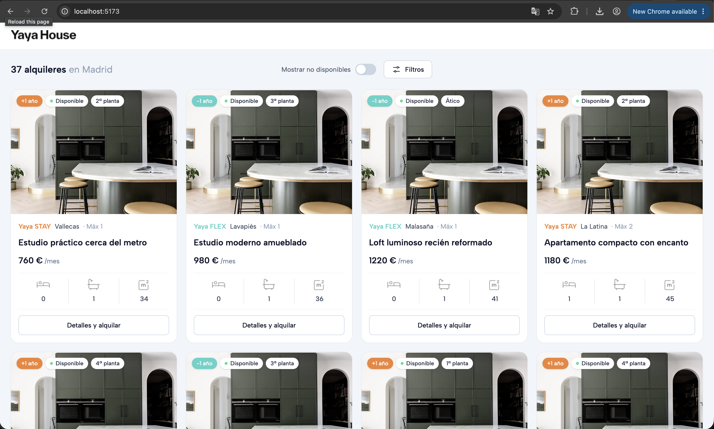

# Yaya House

A filterable catalogue of rental units. 50 apartments parsed from CSV at startup,
filtered server-side by bedrooms and price, rendered as a card grid.



## Running it

Against the CSV, no database required:

```
npm install
npm run dev          # API on :3000, web on :5173 — open http://localhost:5173
```

Or the whole stack in containers — Postgres, migrations, the CSV load, then the two
services, each waiting on the previous one's health rather than on a sleep:

```
make up              # web on :8080, api on :3000
make smoke           # health, ready, a search, and the web origin
make down
```

```
make ci              # lint, typecheck, test, build — the same jobs a pipeline runs
make test-integration# the SQL adapter checked against the in-memory one, live
make help            # every target
```

## Architecture

Three boundaries, each enforced rather than agreed. There is deliberately no directory
map here: `ls` answers that better than a paragraph, and a written one is stale the first
time anything moves.

**Layers are a lint rule.** `no-restricted-imports` in `eslint.config.js` is the authority.
The web app may import `@yaya/contracts` and nothing else, so a server internal cannot
drift onto the wire just by being convenient to import. The domain imports no workspace
package at all. Application code depends on the repository port, never on an adapter.
Crossing a layer fails the build — and `architecture.test.ts` fails if one of those rules
ever stops matching a real directory, which is how a boundary would otherwise disappear
in silence.

**The store is a choice, not a fact.** `FilterState` is a query specification rather than a
predicate over an array, so the same filter is evaluated either by a pass over memory or
as SQL, behind one `PropertyRepository` port. Both adapters ship:
`packages/infrastructure/src/search-equivalence.test.ts` puts eleven filter shapes through
both and asserts identical results *and* identical facet counts, which is what keeps the
in-memory implementation honest as the oracle for the SQL one rather than leaving it as
dead code.

## Decisions

**Filtering runs server-side.** The dataset is 50 rows and would filter in the browser in
a single pass. Server-side was chosen because the filter logic is the part with real
invariants — facet scoping, inclusive bounds, euro-to-cent conversion — and it belongs
where it can be tested without a DOM. The cost is a round trip per Apply, imperceptible
at this size; if the catalogue were guaranteed to stay this small, client-side would be
defensible.

**Each dimension's facet counts exclude that dimension's own selection.** The obvious
implementation counts against the fully-filtered set, which is one line shorter. It was
rejected because options then vanish the moment a user selects one — pick "2 bedrooms"
and every other bedroom count reads zero, so the filter can only ever be narrowed. The
cost is a second pass over the array per dimension, and a `computeFacets` that is
harder to read than a one-liner; `facets.test.ts` exists mostly to hold this in place.

**Availability is a scope, not a facet.** It could have been a third dimension with its
own counts. It isn't, because it must constrain the results *and every facet count*
identically — if it scoped only the results, a bedroom option could read "5" and return
nothing. So `except` never lifts it, and it returns no counts of its own. The cost is
an asymmetry: one control in the toolbar behaves unlike the ones in the modal, which is
also why it applies immediately rather than waiting for Apply.

**Money is a branded `Cents` type; nothing else is branded.** Plain numbers throughout
would be simpler and the Zod schema already rejects malformed input. Money earns the
brand because the euro/cent conversion is silent and the failure is expensive — passing
euros where cents are expected undercharges by 100× and no test would necessarily catch
it. Sizes and room counts stay plain numbers: branding them would force casts through
the bucketing code to catch errors the schema already catches. The cost is one cast,
confined to `money.ts`.

**Prices cross the wire in euros, results come back in cents.** Consistent units either
way would be tidier. Euros won for the query string because `?minPrice=800` is a URL a
human can read and edit, and `api.md` documents that form; cents won for the response
because that is the domain representation and the frontend formats at render. The cost
is a genuine asymmetry in the contract, so `?minPrice=1180.50` is a 400 rather than
silently rounding.

## What's tested

Depth is concentrated rather than spread, per `testing.md`. 51 tests:

- **Facet engine — thoroughly** (16). Exclude-self on both dimensions, zero-count
  options retained, counts responding to the *other* dimension, the availability scope
  applied to counts, bucket edges. Written before the implementation, and the
  implementation was then broken on purpose seven times to confirm each test fails —
  removing exclude-self, dropping zero-count options, ignoring the scope, taking bucket
  spans from the filtered set, and two parser mutations.
- **Filter predicates** (16). Both bounds inclusive, one cent either side of each,
  one-sided ranges, empty selection as no constraint, OR within a dimension, AND across.
- **CSV parser** (7). One fixture with three valid and three malformed rows, asserting
  row numbers, reasons, and the two traps in this data: a studio's `0` bedrooms
  surviving a truthiness check, and `"false"` not being read as truthy.
- **API** (9). Happy path parsed through the response schema, both dimensions together,
  unknown param, non-integer euros, inverted range.
- **Frontend** (3). One test that applying a filter changes the rendered list, plus the
  scope switch and the blocked incoherent range.

Not tested: Tailwind classes, type definitions, third-party behaviour, and the
`Detalles y alquilar` button, which has no destination yet.

## What I'd do next

1. **The dual-handle price slider.** The histogram and buckets are already computed and
   rendered; the control is two number inputs. The slider was deferred to get the
   two-filter interaction visible on the API first.
2. **The remaining dimensions** — bathrooms, size, neighborhood, brand. The domain is
   shaped for it: add a field to `FilterStateSchema`, a predicate, an `except` branch,
   a query param, a control. `.claude/skills/add-filter-dimension` documents the six steps.
3. **Per-property imagery.** Every card renders the same photograph from
   `public/property.jpg` because the CSV has no image column; cards fall back to a
   gradient if it is absent. That placeholder is also a watermarked stock comp, so it
   needs replacing with licensed art before this goes anywhere public.
4. **Restore filter state from the URL.** The query encoding already supports it —
   `?bedrooms=2,3&minPrice=800` is a complete filter specification — but the frontend
   does not read it on load, so links are not yet shareable.
5. **Re-export the icons at 2× or as SVG.** The three card icons and the wordmark are
   1× PNGs (24–29 px) and are soft on retina; PNGs also can't take colour from the
   design tokens. Their layout is settled — each sits in an identical box and scales to
   fit, so the differing aspect ratios no longer read as three different sizes — but no
   amount of CSS makes a 1× asset sharp.
